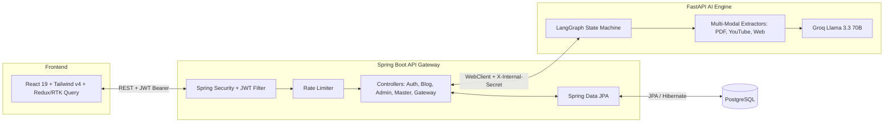
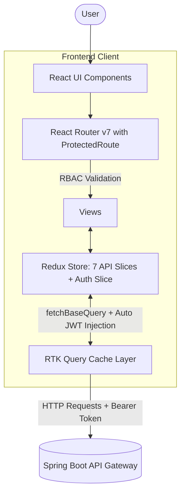
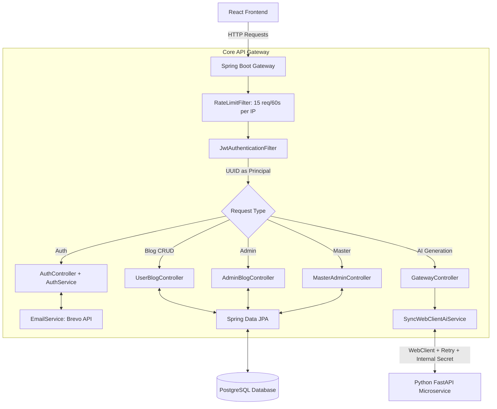
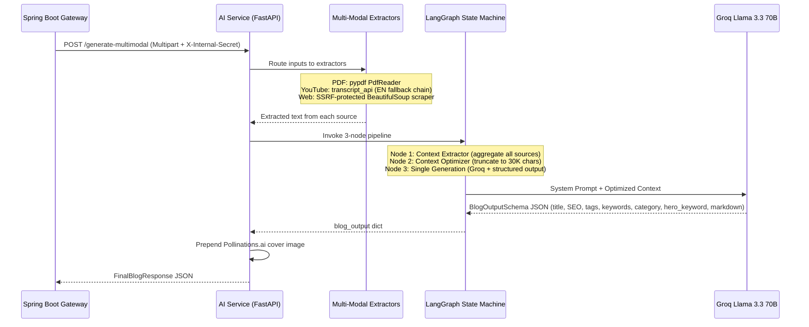

# 🚀 BLOGWHO (agentic blogging platform)

<p align="center">
  
  
  
  
  
  
  
  
  
  
  
  
  
</p>

> 💡 **Overview:** An intelligent, microservice-based SaaS platform that generates high-quality, structured blog posts from multi-modal inputs (PDFs, YouTube videos, websites, raw text) using a stateful LangGraph AI pipeline backed by Groq's Llama 3.3 70B LLM. Features a 3-tier RBAC system, content moderation pipeline, and a comprehensive Master Admin control panel.

---

## ✨ Features at a Glance

| Feature | Description |
| :--- | :--- |
| 🤖 **Multi-Modal AI Generation** | Generate blogs from PDFs, YouTube transcripts, website scraping, and raw text via a 3-node LangGraph pipeline (Extract → Optimize → Generate) |
| ✍️ **AI-Powered Blog Revision** | Instruct the AI to rewrite/modify existing blog content using natural language |
| 🛡️ **3-Tier RBAC** | User → Author → Master Admin with `@PreAuthorize` enforcement on every endpoint |
| 📊 **Master Admin Dashboard** | 8-tab control panel: telemetry sparklines, bulk-approve/delete ops, user management, content review pipeline, AI health monitoring, live prompt editing, dynamic settings |
| 🔒 **Content Lifecycle State Machine** | DRAFT → IN_REVIEW → PUBLISHED/REJECTED with auto-downgrade on post-publish edits |
| ⚡ **Fault-Tolerant AI Bridge** | WebClient with 10x retry (cold start handling), 5-min timeout, automatic quota refund on failure |
| 🖼️ **Auto Cover Images** | AI generates a keyword, system auto-fetches a contextual cover image via Pollinations.ai |
| 📰 **Community Feed** | Public feed with Latest/Top/Trending/Staff Picks algorithms, 23-category filtering, Top 5 Authors |
| 🔐 **Rate Limiting** | Sliding-window IP-based rate limiter (15 req/60s) on auth endpoints |
| 📑 **Bookmark System** | Full CRUD bookmarks with IDOR protection |

---

## 🏗️ High-Level System Architecture



---

## 💻 1. Frontend Client (React 19 & Tailwind v4)

This is the user-facing layer of the platform. It provides a vibrant community feed, a secure dashboard for managing blog drafts, a Tier 3 Master Admin control panel with ASCII telemetry sparklines, and a complex unified Polymorphic Input Interface (XOR-activated) for triggering AI blog generation.

### 🏗️ Architecture & State Flow



### 📂 Frontend Project Structure

```text
src/
├── components/
│   ├── auth/           # (Reserved for auth-specific components)
│   ├── feed/
│   │   └── BlogCard.tsx       # Blog card with bookmark toggle, staff pick badge
│   ├── layout/
│   │   ├── Layout.tsx         # Root layout with <Outlet>
│   │   ├── Navbar.tsx         # Main navigation
│   │   └── TopBar.tsx         # Role-aware top bar
│   ├── tui/
│   │   └── Primitives.tsx     # Full TUI design system 
│   └── ui/
│       ├── Button.tsx         # Simple button
│       ├── Card.tsx           # Simple card
│       ├── Input.tsx          # Styled input
│       └── Mermaid.tsx        # Client-side Mermaid.js renderer
├── pages/
│   ├── FeedLayout.tsx         # 3-column public feed 
│   ├── BlogViewer.tsx         # Full blog reader with Mermaid/code rendering
│   ├── Dashboard.tsx          # User blog management grid
│   ├── Editor.tsx             # Split-pane markdown editor 
│   ├── Generate.tsx           # Multi-modal AI generation 
│   ├── MasterDashboard.tsx    # 8-tab Master Admin panel
│   ├── AdminDashboard.tsx     # Tier-2 admin dashboard
│   ├── AuthorDashboard.tsx    # Author blog dashboard
│   ├── Login.tsx              # Login with JWT storage
│   ├── Register.tsx           # Registration + OTP verification
│   ├── ForgotPassword.tsx     # Forgot password flow
│   ├── ResetPassword.tsx      # Password reset
│   ├── Onboarding.tsx         # Post-registration username/bio setup
│   ├── Profile.tsx            # Profile editing
│   ├── AuthorProfile.tsx      # Public author profile
│   └── PublicFeed.tsx         # Alternate feed view
├── store/
│   ├── index.ts               # configureStore with 7 API slices + auth
│   ├── slices/
│   │   └── authSlice.ts       # JWT decode, setCredentials, logout
│   └── api/
│       ├── baseApi.ts         # fetchBaseQuery + auto JWT injection
│       ├── authApi.ts         # 6 endpoints (login, register, OTP, password reset)
│       ├── blogApi.ts         # 17 endpoints (CRUD, publish, bookmark, feed)
│       ├── generationApi.ts   # generateMultimodal mutation (FormData)
│       ├── masterApi.ts       # 17 endpoints (users, settings, prompts, reviews)
│       ├── adminApi.ts        # 3 endpoints (blog management for authors)
│       ├── publicApi.ts       # 1 endpoint (public settings: maintenance mode)
│       └── userApi.ts         # 3 endpoints (profile, username check)
├── utils/
│   └── logger.ts              # System logging utility
└── assets/                    # Static assets and global CSS
```

### 🔐 Frontend Environment Variables

```env
# Point this to your deployed or local Gateway Service
VITE_API_BASE_URL=http://localhost:8080/api/v1
```

---

## 🛡️ 2. Core API Gateway (Spring Boot)

This service is the central nervous system of the platform. It manages JWT-based authentication with 3-tier RBAC, persists user and blog data to PostgreSQL, implements rate limiting and quota management, and securely routes AI generation requests to the internal Python microservice.

### 🏗️ Architecture & Data Flow



### 📂 Gateway Project Structure

```text
src/main/java/com/saas/gateway/
├── GatewayApplication.java       # Spring Boot entry point
├── core/
│   ├── SecurityConfig.java        # Filter chain, CORS, BCrypt, STATELESS sessions
│   ├── JwtAuthenticationFilter.java # JWT validation, UUID as principal
│   ├── RateLimitFilter.java       # Sliding-window rate limiter (ConcurrentHashMap)
│   ├── WebClientConfig.java       # WebClient.Builder bean
│   └── GlobalExceptionHandler.java # @ControllerAdvice error formatting
├── auth/
│   ├── AuthController.java        # Auth REST endpoints
│   ├── AuthService.java           # Registration, login, OTP verification
│   ├── PasswordResetService.java  # Forgot/reset password flow
│   ├── TokenProvider.java         # HMAC-SHA JWT generation (sub, auth, userId claims)
│   ├── EmailService.java          # Brevo API + branded HTML OTP templates
│   ├── UserDetailsServiceImpl.java # Spring Security UserDetailsService
│   ├── AuthRequest.java           # Record DTO
│   └── AuthResponse.java         # Record DTO
├── blog/
│   ├── BlogDraft.java             # JPA Entity (UUID, user, topic, title, slug, markdown, SEO, tags, views, likes, status, staffPick)
│   ├── Status.java                # Enum: DRAFT, PUBLISHED, GENERATING, FAILED, IN_REVIEW, REJECTED
│   ├── BlogRepository.java       # JPA Repo + atomic @Modifying incrementViewCount
│   ├── UserBlogController.java    # User CRUD + state-machine enforcement
│   ├── AdminBlogController.java   # Tier-2 admin blog management
│   ├── PublicBlogController.java  # Public feed  with pagination, categories, stats
│   ├── BookmarkController.java    # Bookmark CRUD with IDOR protection
│   ├── Bookmark.java              # JPA Entity
│   ├── BookmarkRepository.java    # JPA Repository
│   └── BlogResponseDTO.java      # Entity → API response mapping
├── system/                        # Platform Administration (Tier-3)
│   ├── ErrorLogController.java    # Reads system logs
│   ├── MasterAdminController.java # full platform admin (UserDTO record, user/blog/prompt/settings management, AI health, telemetry trends, reviews)
│   ├── DatabaseSeeder.java        # Seeds prompt, settings, master admin on first boot
│   ├── SystemPrompt.java          # JPA Entity (promptName, promptText)
│   ├── SystemSetting.java         # JPA Entity (settingKey, settingValue)
│   ├── SystemErrorLog.java        # JPA Entity (endpoint, errorMessage)
│   ├── PublicController.java      # Public settings endpoint
│   ├── AuthorStat.java            # DTO Record for JPQL aggregate
│   └── *Repository.java          # JPA Repositories
└── user/
    ├── User.java                  # JPA Entity (UUID, email, passwordHash, username, bio, generationsCount, subscriptionTier, role, isVerified, otp)
    ├── Role.java                  # Enum: USER, ADMIN, MASTER_ADMIN
    ├── SubscriptionTier.java      # Enum: FREE, PRO
    ├── UserRepository.java        # JPA Repo + atomic incrementQuota/decrementQuota + JPQL getAuthorsStats
    ├── UserProfileController.java # Profile CRUD
    └── PublicAuthorController.java # Public author profiles + top authors
```

### 🔐 Gateway Environment Variables

```env
# Database Configuration
DB_URL=jdbc:postgresql://localhost:5432/blog_saas_db
DB_USERNAME=postgres
DB_PASSWORD=your_secure_password

# Authentication (JWT)
JWT_SECRET=...
INTERNAL_SECRET=my-super-secret-internal-key-for-ai-worker

# Email / Brevo Configuration
BREVO_API_KEY=your_brevo_api_key_here
EMAIL_FROM_ADDRESS=noreply@blogwho.com

# Master Admin Seed Credentials (Created on first boot)
MASTER_ADMIN_EMAIL=master@admin.com
MASTER_ADMIN_PASSWORD=supersecretmasterpassword

# AI Service Configuration
AI_SERVICE_URL=http://127.0.0.1:8000

# CORS (for deployment)
CORS_ALLOWED_ORIGINS=http://localhost:5173
```

---

## 🧠 3. AI Generation Service (FastAPI & LangGraph)

Sitting securely behind the Spring Boot API Gateway, this microservice processes multi-modal inputs, orchestrates context extraction through a 3-node LangGraph state machine, and invokes the Groq LLM to generate highly structured, markdown-formatted blog posts with Mermaid diagrams and auto-generated cover images.

### 🏗️ Architecture & Pipeline Flow




### 📂 AI Service Project Structure

```text
ai-service/
├── app/
│   ├── main.py               # FastAPI app: /health, /generate-multimodal, /revise
│   ├── config.py              # pydantic_settings: GROQ_API_KEY, INTERNAL_GATEWAY_SECRET
│   ├── schemas.py             # Pydantic models: BlogOutputSchema, BlogReviseRequest/Response, FinalBlogResponse
│   ├── graph/
│   │   ├── state.py           # TypedDict GraphState (input → pipeline → output)
│   │   ├── workflow.py        # StateGraph: context_extractor → context_optimizer → single_generation → END
│   │   ├── nodes.py           # 3 nodes: extract, optimize (30K chars), generate (ChatGroq + structured output)
│   │   └── revise_workflow.py # Separate revision pipeline (ChatGroq + BlogReviseResponse)
│   └── utils/
│       ├── pdf_extractor.py   # pypdf PdfReader with scanned-image detection
│       ├── yt_extractor.py    # youtube_transcript_api with EN fallback chain
│       └── web_scraper.py     # SSRF-protected BeautifulSoup scraper (blocks private IPs)
├── requirements.txt           # Python dependencies
├── system_prompt.txt          # Default system prompt
└── .env                       # GROQ_API_KEY, INTERNAL_GATEWAY_SECRET, ENV
```

### 🔐 AI Service Environment Variables

> [!CAUTION]
> **NEVER commit this file to version control.**

```env
GROQ_API_KEY=your_groq_api_key_here
INTERNAL_GATEWAY_SECRET=my-super-secret-internal-key-for-ai-worker
ENV=development
```

---

## 🚀 Complete Local Setup Guide

### Prerequisites
- **Node.js**: v18+ (and npm)
- **Java JDK 21+**
- **PostgreSQL 14+**
- **Python 3.10+**

### Step 1: Database Setup

> [!IMPORTANT]
> Before running the application, create the database:

```bash
createdb blog_saas_db
```

### Step 2: Run the Gateway Service (Spring Boot)

> [!WARNING]
> **Windows Users:** Use `.\mvnw.cmd` instead of `./mvnw`

```bash
cd gateway-service/gateway-service

# Clean and compile (Mac/Linux)
./mvnw clean install -DskipTests

# Clean and compile (Windows PowerShell/CMD)
.\mvnw.cmd clean install -DskipTests

# Run the application (Mac/Linux)
./mvnw spring-boot:run

# Run the application (Windows PowerShell/CMD)
.\mvnw.cmd spring-boot:run
```
*Available at `http://localhost:8080`. On first boot, the `DatabaseSeeder` auto-creates the TECH_BLOG_PROMPT, generation limits, and Master Admin user.*

### Step 3: Run the AI Service (FastAPI)

> [!TIP]
> If you run into import issues, use `python -m uvicorn ...`

```bash
cd ai-service

# Create virtual environment
python -m venv .venv

# Activate (Windows PowerShell)
.\.venv\Scripts\activate
# Activate (Mac/Linux)
source .venv/bin/activate

# Install dependencies
pip install -r requirements.txt

# Run the server
uvicorn app.main:app --reload --port 8000
```

### Step 4: Run the Frontend (React)

```bash
cd frontend

# Install dependencies
npm install

# Run the development server
npm run dev

# (Optional) Build for production
npm run build
```

---

## 🔮 Future System Design Roadmap

* **Event-Driven AI Orchestration:** Transitioning from synchronous `WebClient.block()` to an asynchronous message broker (Kafka/RabbitMQ) for non-blocking AI processing.
* **Distributed Rate Limiting:** Migrating the in-memory `ConcurrentHashMap` rate limiter to Redis-backed distributed rate limiting (Bucket4j + Redis) for multi-instance deployments.
* **Redis View Counter Caching:** Adding a Redis write-behind cache for view count aggregation under extreme viral traffic loads.
* **WebSocket Generation Progress:** Real-time progress streaming during AI generation via WebSocket or Server-Sent Events (SSE).
