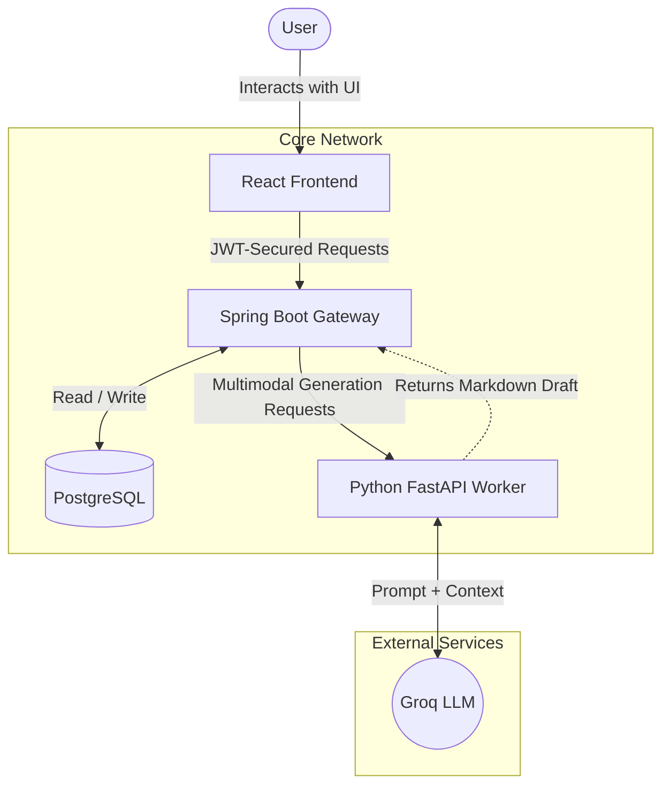

# 🚀 blogWho

<p align="center">
  
  
  
  
  
</p>

The AI Blogging SaaS Platform is a modern 3-tier microservice architecture designed to empower technical writers. It allows users to effortlessly generate highly structured, professional blog posts (complete with Mermaid diagrams) from raw text, PDFs, or external URLs using advanced AI models, manage their drafts securely, and publish them directly to a public community feed.

## 📺 Visual Proof


## 🏗️ High-Level Architecture & System Design

The platform operates on a secure, decoupled microservices model. The following diagram illustrates the complete system flow:



### System Design Workflow:
1. **User Interaction**: Users authenticate and interact via the React Frontend.
2. **API Gateway**: The Spring Boot Gateway securely handles incoming requests, validates JWT tokens, and manages standard CRUD operations directly with PostgreSQL.
3. **AI Generation**: For blog generation requests, the Gateway forwards the multimodal data (PDFs, URLs, Text) to the Python FastAPI Worker.
4. **LLM Orchestration**: The Python Worker processes the context and interfaces with the external Groq LLM.
5. **Fulfillment**: A fully formatted Markdown draft (with Mermaid diagrams) is returned to the Gateway, persisted to the database, and sent back to the user.

## 💻 Tech Stack Breakdown

- **Frontend Layer**:
  - React 18 & Vite
  - Tailwind CSS v4
  - Zustand (State Management)
- **Backend / API Gateway**:
  - Java 17
  - Spring Boot 3
  - Spring Security (JWT-based RBAC)
  - PostgreSQL (Relational Database)
- **AI & Data Layer**:
  - Python 3.10
  - FastAPI
  - Groq LLM Integration

## 🛠️ Prerequisites

To run this platform locally, ensure you have the following installed globally on your machine:
- **Node.js** (v18+)
- **Java JDK** (17+)
- **Python** (3.10+)
- **PostgreSQL** (14+)

## 🔐 Global Environment Variables

Create the necessary `.env` files across your services based on this consolidated `.env.example`. This covers the required configuration for the entire platform so you can see exactly what needs to be configured:

```env
# ----------------------------------------
# GATEWAY SERVICE (gateway-service/gateway-service/.env)
# ----------------------------------------
DB_URL=jdbc:postgresql://localhost:5432/blog_saas_db
DB_USERNAME=postgres
DB_PASSWORD=your_secure_password
JWT_SECRET=404E635266556A586E3272357538782F413F4428472B4B6250645367566B5970
INTERNAL_SECRET=my-super-secret-internal-key-for-ai-worker
AI_SERVICE_URL=http://127.0.0.1:8000

# ----------------------------------------
# AI SERVICE (ai-service/.env)
# ----------------------------------------
GROQ_API_KEY=your_groq_api_key_here
INTERNAL_GATEWAY_SECRET=my-super-secret-internal-key-for-ai-worker
ENV=development

# ----------------------------------------
# FRONTEND (frontend/.env)
# ----------------------------------------
VITE_API_BASE_URL=http://localhost:8080/api/v1
```

## 🚀 Quickstart / Running Locally

Follow these sequential terminal commands to boot the whole system:

### 1. Database Setup
Open your PostgreSQL terminal (or pgAdmin) and create the database:
```sql
CREATE DATABASE blog_saas_db;
```

### 2. Run the AI Service (FastAPI)
```bash
cd ai-service
python -m venv .venv
# On Windows: .\.venv\Scripts\activate
# On Mac/Linux: source .venv/bin/activate
pip install -r requirements.txt
uvicorn app.main:app --reload --port 8000
```

### 3. Run the Gateway Service (Spring Boot)
Open a new terminal window:
```bash
cd gateway-service/gateway-service
./mvnw spring-boot:run
```

### 4. Run the Frontend (React)
Open a final terminal window:
```bash
cd frontend
npm install
npm run dev
```

## 📂 Repository Structure

The monorepo is divided into three distinct services. **Each folder contains its own dedicated `README.md`** with deeper technical specifics.

- `/frontend`: The React 18 SPA. Contains UI components, Zustand store, and Vite configuration.
- `/gateway-service`: The Spring Boot API Gateway. Contains standard controllers, Spring Security configurations, JPA entities, and database migrations.
- `/ai-service`: The Python worker. Contains the FastAPI app, extraction logic, and Groq LLM integration.
