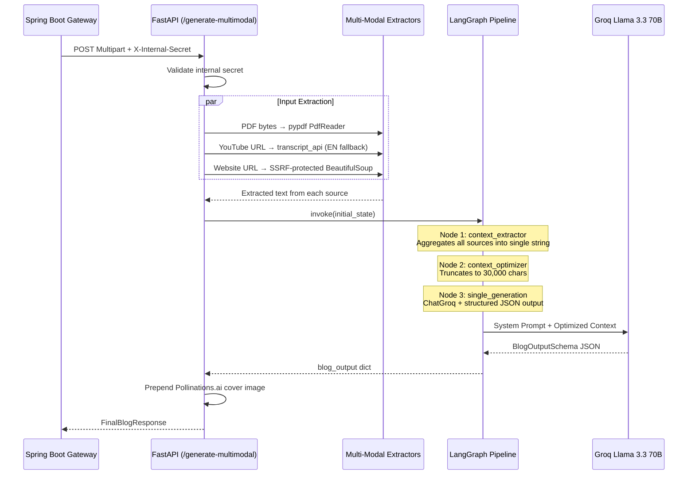

# 🧠 AI Generation Service — FastAPI & LangGraph

> FastAPI | LangGraph | Groq (Llama 3.3 70B) | Pydantic v2 | Python 3.10+

The AI orchestration engine for the Agentic Blog Generation SaaS. This microservice sits behind the Spring Boot API Gateway (never directly exposed to end users) and processes multi-modal inputs through a stateful 3-node LangGraph pipeline to generate structured, markdown-formatted blog posts with auto-generated cover images.

---

## 🏗️ Architecture



---

## 📦 Project Structure

```text
ai-service/
├── app/
│   ├── main.py               # FastAPI app with 3 endpoints
│   ├── config.py              # pydantic_settings: GROQ_API_KEY, INTERNAL_GATEWAY_SECRET, ENV
│   ├── schemas.py             # Pydantic models for request/response validation
│   ├── graph/
│   │   ├── state.py           # TypedDict GraphState (7 fields: inputs → pipeline → output)
│   │   ├── workflow.py        # StateGraph builder: 3 nodes → END
│   │   ├── nodes.py           # Node implementations (extract, optimize, generate)
│   │   └── revise_workflow.py # Blog revision pipeline (separate from main generation)
│   └── utils/
│       ├── pdf_extractor.py   # pypdf PdfReader with scanned-image detection
│       ├── yt_extractor.py    # youtube_transcript_api with 3-tier fallback (manual EN → auto EN → any)
│       └── web_scraper.py     # SSRF-protected web scraper (validates against private/loopback IPs)
├── requirements.txt
└── .env
```

---

## 🔗 API Endpoints

### `GET /health`
Simple health check. Returns `{"status": "ok", "service": "ai-worker"}`. Pinged by the Master Admin Dashboard for real-time AI health monitoring.

### `POST /api/v1/blogs/generate-multimodal`
Multi-modal blog generation pipeline.

| Parameter | Type | Required | Description |
|---|---|---|---|
| `system_prompt` | Form | ✅ | LLM instructions (loaded from DB by Gateway) |
| `topic` | Form | ❌ | Topic override (AI infers from context if empty) |
| `website_url` | Form | ❌ | Website URL to scrape (SSRF-protected) |
| `youtube_url` | Form | ❌ | YouTube video to extract transcript from |
| `raw_text` | Form | ❌ | Direct text input |
| `pdf_file` | File | ❌ | PDF document for text extraction |

**Response:** `FinalBlogResponse` containing:
- `blog`: `BlogOutputSchema` (title, seo_description, tags, seo_keywords, category, hero_image_keyword, markdown_content)
- `source_context`: Raw extracted/aggregated text used by the AI

### `POST /api/v1/blogs/revise`
AI-powered blog content revision.

| Parameter | Type | Required | Description |
|---|---|---|---|
| `current_markdown` | JSON | ✅ | Existing blog markdown content |
| `instruction` | JSON | ✅ | Natural language revision instruction (e.g., "make it more professional") |

**Response:** `BlogReviseResponse` with `revised_markdown`.

---

## 🧩 LangGraph Pipeline Details

### Node 1: Context Extractor (`context_extractor_node`)
Aggregates all non-empty input sources into a single context string:
```text
Topic: {topic}
Raw Text Input: {raw_text}
PDF Content: {pdf_text}
Website Content: {website_text}
YouTube Transcript: {youtube_transcript}
```

### Node 2: Context Optimizer (`context_optimizer_node`)
Truncates the aggregated context to **30,000 characters** max to prevent Groq API token overflow errors. Appends `[TRUNCATED TO OPTIMIZE FOOTPRINT]` when truncation occurs.

### Node 3: Single Generation (`single_generation_node`)
Invokes `ChatGroq` (Llama 3.3 70B Versatile) with `structured_output` (JSON mode) using the `BlogOutputSchema` Pydantic model. This ensures the LLM always returns valid, schema-conforming JSON.

---

## 🛡️ Security

### Internal Authentication
Every endpoint (except `/health`) is protected by the `verify_internal_secret` dependency:
```python
def verify_internal_secret(x_internal_secret: str = Header(...)):
    if x_internal_secret != settings.INTERNAL_GATEWAY_SECRET:
        raise HTTPException(status_code=403, detail="Forbidden")
```
**This service is NEVER exposed to end users. Only the Spring Boot Gateway can call it.**

### SSRF Protection (`web_scraper.py`)
Before fetching any URL, the scraper:
1. Validates URL scheme (only `http`/`https`)
2. Resolves hostname to IP via DNS
3. Checks if the resolved IP is private, loopback, link-local, or multicast
4. Blocks the request if any check fails

```python
def is_safe_url(url: str) -> bool:
    ip = ipaddress.ip_address(socket.gethostbyname(parsed.hostname))
    if ip.is_private or ip.is_loopback or ip.is_link_local or ip.is_multicast:
        return False
```

---

## 🚀 Quick Start

```bash
cd ai-service

# Create and activate virtual environment
python -m venv .venv
# Windows: .\.venv\Scripts\activate
# Mac/Linux: source .venv/bin/activate

# Install dependencies
pip install -r requirements.txt

# Run the server
uvicorn app.main:app --reload --port 8000
```

## 🔐 Environment Variables

```env
GROQ_API_KEY=your_groq_api_key_here
INTERNAL_GATEWAY_SECRET=my-super-secret-internal-key-for-ai-worker
ENV=development
```
