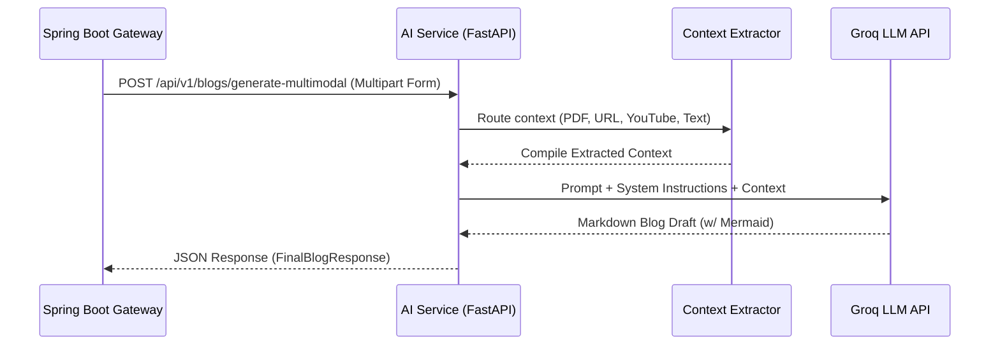

# 🧠 AI Generation Service (FastAPI)

<p align="center">
  
  
  
  
</p>

This microservice acts as the core AI engine for the Agentic Blog Generation SaaS. Sitting securely behind the Spring Boot API Gateway, it processes multi-modal inputs (Text, YouTube URLs, Website URLs, PDF files), orchestrates context extraction, and utilizes the Groq LLM to generate highly structured, markdown-formatted technical blog posts complete with Mermaid diagrams.

## 🏗️ Architecture Data Flow

The following sequence diagram outlines how the service handles a multi-modal generation request:



## 🛠️ Setup & Installation

Follow these steps to set up the microservice locally:

1. **Navigate to the service directory:**
   ```bash
   cd ai-service
   ```

2. **Create a virtual environment:**
   ```bash
   python -m venv .venv
   ```

3. **Activate the environment:**
   - **Windows (PowerShell):**
     ```bash
     .\.venv\Scripts\activate
     ```
   - **Mac/Linux:**
     ```bash
     source .venv/bin/activate
     ```

4. **Install the dependencies:**
   ```bash
   pip install -r requirements.txt
   ```

## 🔐 Environment Variables

## 🔐 Environment Variables

> [!CAUTION]
> **NEVER commit this file to version control.**

Create a `.env` file in the root of the `ai-service` directory:

```env
# Required: Your Groq API key for LLM generation
GROQ_API_KEY=your_groq_api_key_here

# Required: The secret key shared with the Gateway for internal authentication
INTERNAL_GATEWAY_SECRET=my-super-secret-internal-key-for-ai-worker

# Environment setting (development/production)
ENV=development
```

## 🚀 Running the Server

To start the FastAPI server locally with hot-reloading enabled, use the exact Uvicorn command below:

```bash
uvicorn app.main:app --reload --port 8000
```

> [!TIP]
> If you run into import issues, ensure you prefix the command with `python -m uvicorn ...` if your virtual environment is not correctly in your PATH.

## 📚 API Reference

### Generate Multimodal Blog
**Endpoint**: `POST /api/v1/blogs/generate-multimodal`

This endpoint expects a `multipart/form-data` payload to securely handle file uploads and context data.

**Request Payload:**
- `system_prompt` (Text, Required): Instructions for the LLM.
- `topic` (Text, Optional): Specific topic override.
- `website_url` (Text, Optional): Target website to scrape.
- `youtube_url` (Text, Optional): YouTube video to transcribe.
- `raw_text` (Text, Optional): Direct text context.
- `pdf_file` (File, Optional): PDF document for text extraction.
- `X-Internal-Secret` (Header, Required): Shared authentication secret.

**Response (JSON):**
Returns a structured `FinalBlogResponse` containing the generated blog data, title, SEO keywords, and the source context utilized.
