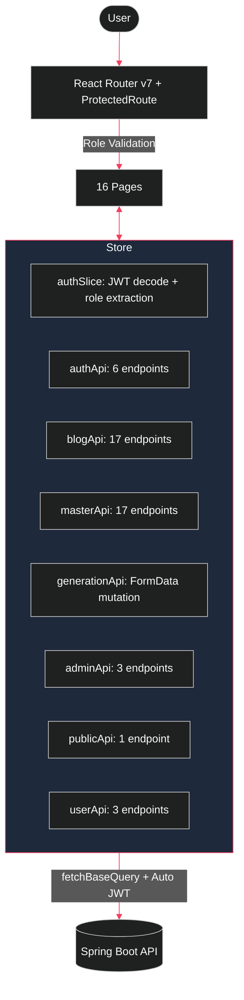

# 🎨 Frontend Client — blogWho.

> React 19 + Tailwind CSS v4 + Redux Toolkit (RTK Query) + Vite 6

The user-facing layer of the Agentic Blog Generation SaaS platform. Provides a community-driven blog feed, a personal dashboard for managing AI-generated drafts, a split-pane markdown editor with live Mermaid.js diagram rendering, and a comprehensive 8-tab Master Admin control panel.

---

## 🏗️ Architecture



### Key Design Decisions

1. **RTK Query over raw Axios**: All API communication is declarative, cached, and auto-invalidated. Zero manual loading state management.
2. **JWT in Redux State**: Token is stored in `localStorage` and loaded into Redux on app mount. `prepareHeaders` auto-injects `Bearer` token on every request.
3. **Role-Aware Routing**: `ProtectedRoute` reads `role` from the decoded JWT payload to conditionally render USER, ADMIN, or MASTER_ADMIN views.
4. **Custom TUI Design System**: Built a 248-line `Primitives.tsx` component library (Button, Panel, Table, Tabs, Progress bar, StatusBadge, RoleBadge, ThinkingDots, Modal, TopNav) for consistent terminal-aesthetic styling across 16 pages.

---

## 📄 Pages Overview

| Page | Lines | Description |
|---|---|---|
| `MasterDashboard.tsx` | 492 | 8-tab Tier-3 admin: Overview, Users, Authors, Blogs, Reviews, Logs, Prompts, Settings |
| `Editor.tsx` | 308 | Split-pane markdown editor with live preview, Mermaid rendering, AI Revise modal, Publish/Review modal with SEO metadata |
| `FeedLayout.tsx` | 229 | 3-column public feed: categories sidebar, Latest/Top feed with pagination, Trending/Staff Picks/Top Authors widgets |
| `BlogViewer.tsx` | 171 | Full blog reader with rich markdown rendering, syntax highlighting, Mermaid diagrams, SEO meta tag injection |
| `Generate.tsx` | — | Multi-modal AI generation: Topic, Website URL, YouTube URL, Raw Text, PDF upload. Maintenance mode banner. |
| `Dashboard.tsx` | 93 | User blog management grid with status badges, generation quota display, edit/delete actions |
| `Register.tsx` | — | Email/password registration → OTP email verification step |
| `Login.tsx` | — | JWT-based login with credential validation |

---

## 🧩 Component Library (`components/tui/Primitives.tsx`)

| Component | Description |
|---|---|
| `Button` | Ghost/Accent/Danger variants with animated hover arrow `▸` |
| `Panel` | Bordered card with floating label title |
| `Table` | Column-header table with hover-highlighted rows |
| `Tabs` | Tab bar with active tab border styling |
| `Progress` | ASCII block bar: `▕████░░░░▏ 65%` |
| `StatusBadge` | Color-coded: ✓ success, ✗ error, ○ warning, ▶ running |
| `RoleBadge` | USER (gray), AUTHOR (yellow), MASTER ADMIN (purple) |
| `ThinkingDots` | Animated `· ·· ···` loading indicator |
| `Modal` | Overlay dialog with title, close button, content slot |
| `TopNav` | Navigation bar with brand, links, Support modal |

---

## 🚀 Quick Start

```bash
# Install dependencies
npm install

# Start development server
npm run dev

# Build for production
npm run build
```

## 🔐 Environment Variables

```env
VITE_API_BASE_URL=http://localhost:8080/api/v1
VITE_SUPPORT_EMAIL=support@blogwho.com
```
