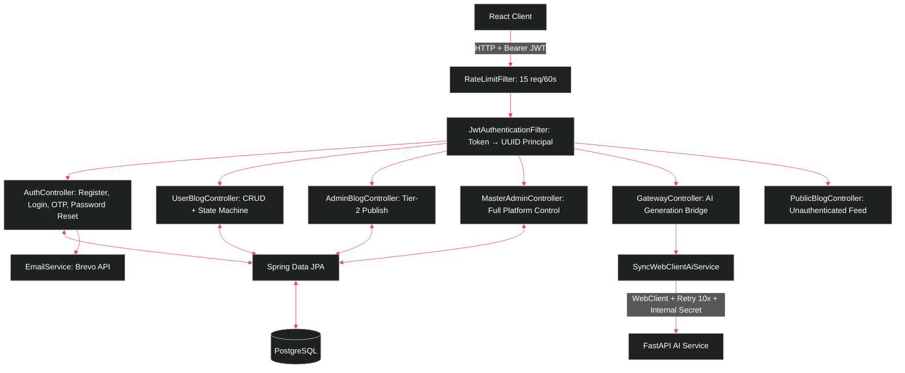

# 🛡️ Gateway Service — Spring Boot API Core

> Spring Boot 4.x | Java 21+ | Spring Security | Spring Data JPA | PostgreSQL | WebClient

The central API Gateway and business logic service for the Agentic Blog Generation SaaS. Handles JWT authentication, 3-tier RBAC enforcement, blog lifecycle management, quota-controlled AI generation requests, transactional email delivery, and a comprehensive Master Admin control plane.

---

## 🏗️ Architecture



---

## 📦 Package Structure

```text
com.saas.gateway/
├── core/                          # Infrastructure & Security
│   ├── SecurityConfig.java         # CSRF off, STATELESS, JWT filter chain, CORS from env
│   ├── JwtAuthenticationFilter.java # Extract JWT → validate → set UUID as SecurityContext principal
│   ├── RateLimitFilter.java        # Sliding-window rate limiter (ConcurrentHashMap + ConcurrentLinkedDeque)
│   ├── WebClientConfig.java        # WebClient.Builder bean
│   └── GlobalExceptionHandler.java # @ControllerAdvice
│
├── auth/                          # Authentication & Email
│   ├── AuthController.java        # 7 REST endpoints
│   ├── AuthService.java           # Registration (with unverified user re-registration), Login, OTP verification
│   ├── PasswordResetService.java  # Forgot/Reset password (anti-enumeration)
│   ├── TokenProvider.java         # HMAC-SHA JWT (sub: email, auth: role, userId: UUID)
│   ├── EmailService.java          # Brevo API integration, branded HTML OTP templates, console fallback
│   ├── UserDetailsServiceImpl.java
│   ├── AuthRequest.java           # Record(email, password)
│   └── AuthResponse.java         # Record(token, email)
│
├── blog/                          # Content Management
│   ├── BlogDraft.java             # JPA Entity: UUID, user, topic, title, slug, rawMarkdown, SEO fields, tags, views, likes, status, staffPick
│   ├── Status.java                # DRAFT, PUBLISHED, GENERATING, FAILED, IN_REVIEW, REJECTED
│   ├── BlogRepository.java       # Paginated queries + atomic @Modifying incrementViewCount
│   ├── UserBlogController.java    # User CRUD + PUBLISHED→IN_REVIEW auto-downgrade + AI revision endpoint
│   ├── AdminBlogController.java   # Tier-2: list all blogs, delete, publish
│   ├── PublicBlogController.java  # Latest/Trending/Top/StaffPicks feeds, pagination, category filter, view counter, platform stats
│   ├── BookmarkController.java    # CRUD bookmarks with IDOR protection
│   ├── Bookmark.java / BookmarkRepository.java
│   └── BlogResponseDTO.java
│
├── gateway/                       # AI Service Bridge
│   ├── AiGenerationService.java   # Interface: generateMultimodal(), reviseBlog()
│   ├── GatewayController.java     # POST /gateway/generate-multimodal (multipart)
│   └── SyncWebClientAiService.java # 5-step pipeline: quota validation → prompt loading → multipart marshalling → retry invocation → persistence/refund
│
├── system/                        # Platform Administration
│   ├── MasterAdminController.java # 246 lines: UserDTO, 15+ endpoints (users, errors, prompts, settings, stats, AI health, reviews)
│   ├── DatabaseSeeder.java        # CommandLineRunner: seeds prompt, limits, master admin user
│   ├── SystemPrompt.java          # JPA: promptName (unique), promptText (TEXT)
│   ├── SystemSetting.java         # JPA: settingKey (unique), settingValue
│   ├── SystemErrorLog.java        # JPA: endpoint, errorMessage, createdAt
│   ├── PublicController.java      # Unauthenticated settings (maintenance, announcements)
│   └── AuthorStat.java            # DTO Record for JPQL aggregate
│
└── user/                          # User Domain
    ├── User.java                  # JPA: UUID, email, passwordHash, username, bio, generationsCount, subscriptionTier, role, isVerified, otp/otpExpiry
    ├── Role.java                  # USER, ADMIN, MASTER_ADMIN
    ├── SubscriptionTier.java      # FREE, PRO
    ├── UserRepository.java        # findByEmail, atomic incrementQuota/decrementQuota, JPQL getAuthorsStats
    ├── UserProfileController.java # GET/PUT profile
    └── PublicAuthorController.java # Top 5 authors, public author profile
```

---


## 🚀 Quick Start

```bash
cd gateway-service/gateway-service

# Windows
.\mvnw.cmd clean install -DskipTests
.\mvnw.cmd spring-boot:run

# Mac/Linux 
./mvnw clean install -DskipTests
./mvnw spring-boot:run
```

## 🔐 Environment Variables

```env
DB_URL=jdbc:postgresql://localhost:5432/blog_saas_db
DB_USERNAME=postgres
DB_PASSWORD=your_password
JWT_SECRET=...
INTERNAL_SECRET=...
BREVO_API_KEY=...
EMAIL_FROM_ADDRESS=...
MASTER_ADMIN_EMAIL=...
MASTER_ADMIN_PASSWORD=...
AI_SERVICE_URL=http://[IP_ADDRESS]
CORS_ALLOWED_ORIGINS=http://localhost:5173
```
