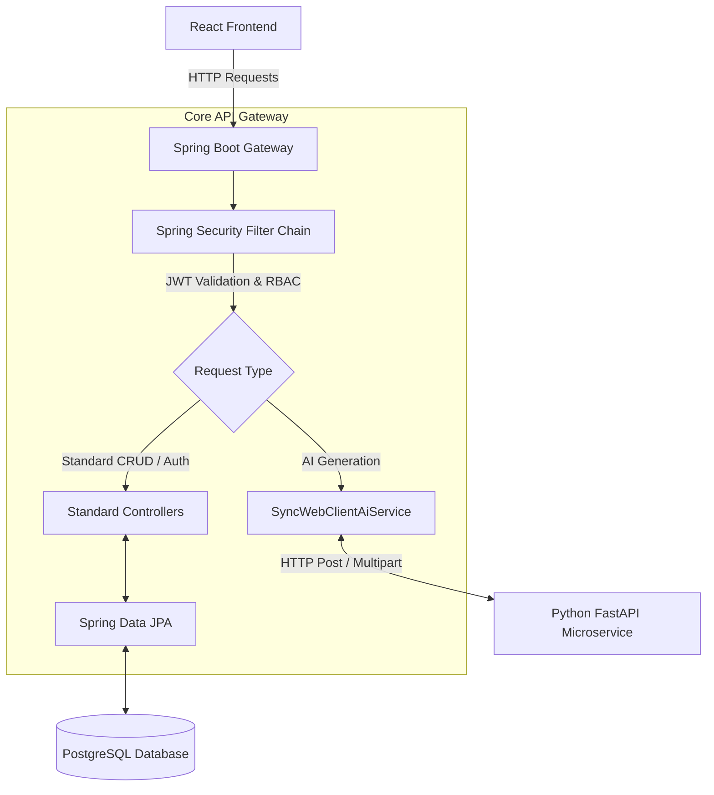

# 🛡️ Core API Gateway (Spring Boot)


This service is the central nervous system of the Agentic Blogging SaaS platform. It manages robust JWT-based authentication with Role-Based Access Control (RBAC), persists user and blog data to PostgreSQL, and securely routes heavy multi-modal generation requests to the internal Python AI microservice.

## 🏗️ Architecture & Data Flow

The flowchart below visualizes how requests are intercepted, validated, and routed through the Gateway:



## 🛠️ Prerequisites & Setup

Ensure the following tools are installed on your system:
- **Java JDK 17+**
- **PostgreSQL 14+**
- **Maven** (optional, as the Maven Wrapper `./mvnw` is provided)

**Database Initialization:**
Before running the application, you must create the database in your local PostgreSQL instance:
```sql
CREATE DATABASE blog_saas_db;
```

## 🔐 Environment Variables

The application relies on several environment variables. You can provide these via an `.env` file or export them directly into your terminal before starting the server.

```env
# Database Configuration
DB_URL=jdbc:postgresql://localhost:5432/blog_saas_db
DB_USERNAME=postgres
DB_PASSWORD=your_secure_password

# Authentication (JWT)
JWT_SECRET=404E635266556A586E3272357538782F413F4428472B4B6250645367566B5970
INTERNAL_SECRET=my-super-secret-internal-key-for-ai-worker

# Master Admin Seed Credentials (Created on first boot)
MASTER_ADMIN_EMAIL=master@admin.com
MASTER_ADMIN_PASSWORD=supersecretmasterpassword

# AI Service Configuration
AI_SERVICE_URL=http://127.0.0.1:8000
```

## 🚀 Installation & Running

Use the provided Maven Wrapper to compile and run the application without needing a global Maven installation.

1. **Clean and compile the project:**
   ```bash
   ./mvnw clean install -DskipTests
   ```

2. **Run the application locally:**
   ```bash
   ./mvnw spring-boot:run
   ```

The Gateway Service will be available at `http://localhost:8080`.

## 📚 Core API Endpoints

The Gateway exposes the following primary REST controller domains:

- **Authentication:** `POST /api/v1/auth/*`
  Handles user registration, login, and JWT issuance.
  
- **Blog Management:** `GET/POST /api/v1/blogs/*`
  Handles CRUD operations for blog drafts, publishing, and bookmarking.
  
- **AI Generation Bridge:** `POST /api/v1/gateway/generate-multimodal`
  Secured endpoint that intercepts multi-modal input (PDFs, URLs) and proxies the request to the Python AI Microservice, awaiting the final Markdown draft.
  
- **Master Admin Controls:** `GET/POST/PUT /api/v1/master/*`
  Highly privileged Tier-3 routes for managing global system settings, user quotas, and viewing system error logs.
